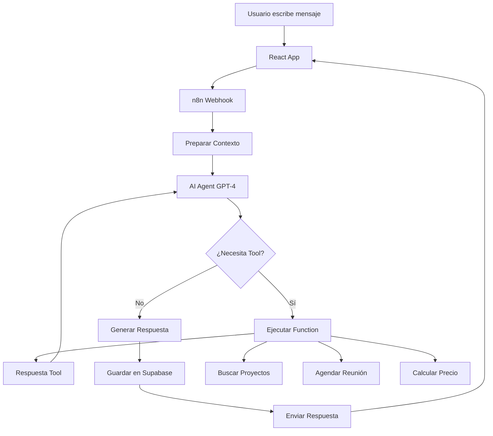

# Integración de AI Agents con n8n para Cloe Chat

## Arquitectura Completa

```
React App (Vercel) → n8n Webhook → AI Agent → Supabase → Respuesta
                                 ↓
                          [OpenAI/Claude/Llama]
                                 ↓
                        [Tools & Functions]
                                 ↓
                    [CRM/Email/Database/APIs]
```

## 1. Configuración del AI Agent en n8n

### Opción A: Usando el nodo AI Agent

n8n tiene un nodo nativo de **AI Agent** que puedes usar:

```yaml
Workflow:
  1. Webhook (trigger)
  2. AI Agent (procesamiento)
  3. Supabase (guardar conversación)
  4. Respond to Webhook (respuesta)
```

### Configuración del nodo AI Agent:

```javascript
{
  "agent": {
    "type": "conversational",
    "model": "gpt-4", // o "claude-3", "llama-2"
    "temperature": 0.7,
    "systemPrompt": `
      Eres Cloe, el asistente virtual de Grupo DTE. 
      Tu objetivo es ayudar a los usuarios con información sobre:
      - Servicios de desarrollo web
      - Automatización de marketing
      - Diseño personalizado
      - Proyectos realizados
      
      Personalidad: Amigable, profesional, argentina (usar voseo).
      
      Cuando detectes intención de contacto, sugiere agendar una reunión.
      Cuando pregunten por precios, pide más detalles del proyecto.
    `,
    "tools": [
      "searchProjects",
      "getServiceInfo",
      "scheduleCall",
      "saveToSupabase"
    ]
  }
}
```

### Opción B: Workflow Personalizado con OpenAI

```
Webhook → Function (Contexto) → OpenAI → Supabase → Response
                              ↓
                    Tool Functions (opcional)
```

## 2. Implementación del Workflow Completo

### Paso 1: Webhook Trigger

```json
{
  "webhookUrl": "/webhook/cloe-chat",
  "method": "POST",
  "responseMode": "onReceived",
  "responseData": "allEntries"
}
```

### Paso 2: Preparar Contexto (Function Node)

```javascript
// Nodo: Preparar Contexto para AI
const { conversationId, message, context } = $input.all()[0].json;

// Obtener historial de Supabase si existe
const supabaseUrl = $env.SUPABASE_URL;
const supabaseKey = $env.SUPABASE_SERVICE_KEY;

// Preparar contexto enriquecido
const enrichedContext = {
  conversationId,
  userMessage: message,
  page: context.page,
  timestamp: new Date().toISOString(),
  previousMessages: context.previousMessages || [],
  // Agregar información adicional según la página
  pageContext: getPageContext(context.page)
};

function getPageContext(page) {
  const contexts = {
    '/development': 'Usuario está viendo proyectos de desarrollo',
    '/services': 'Usuario está explorando servicios',
    '/contact': 'Usuario quiere contactar',
    '/': 'Usuario está en página principal'
  };
  return contexts[page] || 'Usuario navegando el sitio';
}

return enrichedContext;
```

### Paso 3: AI Agent con Tools

```javascript
// Configuración del AI Agent con herramientas
{
  "agent": {
    "type": "openai-functions",
    "model": "gpt-4-1106-preview",
    "messages": [
      {
        "role": "system",
        "content": `Sos Cloe, asistente de Grupo DTE...`
      }
    ],
    "functions": [
      {
        "name": "buscar_proyectos",
        "description": "Busca proyectos relevantes en la base de datos",
        "parameters": {
          "type": "object",
          "properties": {
            "categoria": {
              "type": "string",
              "enum": ["web", "mobile", "automatizacion", "todos"]
            },
            "keywords": {
              "type": "array",
              "items": { "type": "string" }
            }
          }
        }
      },
      {
        "name": "agendar_reunion",
        "description": "Agenda una reunión con el equipo comercial",
        "parameters": {
          "type": "object",
          "properties": {
            "nombre": { "type": "string" },
            "email": { "type": "string" },
            "telefono": { "type": "string" },
            "empresa": { "type": "string" },
            "mensaje": { "type": "string" }
          },
          "required": ["nombre", "email"]
        }
      },
      {
        "name": "obtener_precio_estimado",
        "description": "Calcula precio estimado según requerimientos",
        "parameters": {
          "type": "object",
          "properties": {
            "tipo_proyecto": {
              "type": "string",
              "enum": ["landing", "ecommerce", "webapp", "mobile"]
            },
            "funcionalidades": {
              "type": "array",
              "items": { "type": "string" }
            },
            "plazo": {
              "type": "string",
              "enum": ["urgente", "normal", "flexible"]
            }
          }
        }
      }
    ]
  }
}
```

### Paso 4: Implementar Tool Functions

```javascript
// Nodo: Ejecutar Tool Functions
const { function_call } = $input.all()[0].json;

if (!function_call) {
  return { result: null };
}

const functionName = function_call.name;
const args = JSON.parse(function_call.arguments);

switch (functionName) {
  case 'buscar_proyectos':
    return await buscarProyectos(args);
    
  case 'agendar_reunion':
    return await agendarReunion(args);
    
  case 'obtener_precio_estimado':
    return await calcularPrecio(args);
    
  default:
    return { error: 'Función no encontrada' };
}

async function buscarProyectos({ categoria, keywords }) {
  // Consultar Supabase
  const { data, error } = await $supabase
    .from('projects')
    .select('*')
    .eq('category', categoria)
    .textSearch('description', keywords.join(' '))
    .limit(3);
    
  return {
    result: data ? 
      `Encontré estos proyectos relevantes: ${data.map(p => p.title).join(', ')}` :
      'No encontré proyectos específicos, pero podemos crear algo personalizado.'
  };
}

async function agendarReunion(datos) {
  // Guardar en Supabase
  const { data, error } = await $supabase
    .from('leads')
    .insert({
      ...datos,
      source: 'cloe_chat',
      created_at: new Date()
    });
    
  // Enviar notificación (webhook, email, etc)
  await notificarEquipo(datos);
    
  return {
    result: '¡Perfecto! Agendé una reunión. El equipo se contactará en las próximas 24hs.'
  };
}
```

### Paso 5: Guardar en Supabase

```javascript
// Nodo: Guardar Conversación
const { conversationId, userMessage, aiResponse } = $input.all()[0].json;

const { data, error } = await $supabase
  .from('chat_conversations')
  .insert({
    conversation_id: conversationId,
    messages: {
      user: userMessage,
      assistant: aiResponse,
      timestamp: new Date(),
      metadata: {
        page: context.page,
        tools_used: toolsUsed || []
      }
    }
  });

return { saved: !error };
```

## 3. Estructura de Base de Datos en Supabase

```sql
-- Tabla de conversaciones
CREATE TABLE chat_conversations (
  id UUID DEFAULT gen_random_uuid() PRIMARY KEY,
  conversation_id TEXT UNIQUE NOT NULL,
  created_at TIMESTAMP DEFAULT NOW(),
  updated_at TIMESTAMP DEFAULT NOW(),
  user_id TEXT,
  metadata JSONB
);

-- Tabla de mensajes
CREATE TABLE chat_messages (
  id UUID DEFAULT gen_random_uuid() PRIMARY KEY,
  conversation_id TEXT REFERENCES chat_conversations(conversation_id),
  role TEXT NOT NULL CHECK (role IN ('user', 'assistant', 'system')),
  content TEXT NOT NULL,
  created_at TIMESTAMP DEFAULT NOW(),
  metadata JSONB
);

-- Tabla de leads generados
CREATE TABLE chat_leads (
  id UUID DEFAULT gen_random_uuid() PRIMARY KEY,
  conversation_id TEXT,
  nombre TEXT NOT NULL,
  email TEXT NOT NULL,
  telefono TEXT,
  empresa TEXT,
  mensaje TEXT,
  source TEXT DEFAULT 'cloe_chat',
  created_at TIMESTAMP DEFAULT NOW(),
  status TEXT DEFAULT 'new'
);

-- Índices para mejor performance
CREATE INDEX idx_conversations_id ON chat_conversations(conversation_id);
CREATE INDEX idx_messages_conversation ON chat_messages(conversation_id);
CREATE INDEX idx_messages_created ON chat_messages(created_at);
```

## 4. Variables de Entorno

```env
# n8n
N8N_WEBHOOK_URL=https://your-n8n.com/webhook/cloe-chat

# Supabase
SUPABASE_URL=https://xxxxx.supabase.co
SUPABASE_ANON_KEY=eyJhbGciOiJIUzI1NiIsInR5cCI6IkpXVCJ9...
SUPABASE_SERVICE_KEY=eyJhbGciOiJIUzI1NiIsInR5cCI6IkpXVCJ9...

# OpenAI
OPENAI_API_KEY=sk-...

# Notificaciones
SLACK_WEBHOOK=https://hooks.slack.com/services/...
TEAM_EMAIL=equipo@grupodte.com
```

## 5. Flujo Completo de Ejemplo



## 6. Ventajas de esta Arquitectura

1. **AI Inteligente**: El agente puede usar herramientas para dar respuestas precisas
2. **Persistencia**: Todas las conversaciones se guardan en Supabase
3. **Escalabilidad**: Fácil agregar nuevas herramientas y funciones
4. **Analytics**: Datos estructurados para análisis posterior
5. **Integración**: Conecta con CRM, email, Slack, etc.
6. **Personalización**: Respuestas contextuales según la página

## 7. Testing del Workflow

```bash
# Test básico
curl -X POST https://your-n8n.com/webhook/cloe-chat \
  -H "Content-Type: application/json" \
  -d '{
    "conversationId": "test_123",
    "message": "Quiero hacer una web para mi empresa",
    "context": {
      "page": "/services",
      "timestamp": "2024-01-07T10:00:00Z"
    }
  }'

# Test con intención de contacto
curl -X POST https://your-n8n.com/webhook/cloe-chat \
  -H "Content-Type: application/json" \
  -d '{
    "conversationId": "test_456",
    "message": "Me gustaría agendar una reunión para discutir un proyecto",
    "context": {
      "page": "/contact"
    }
  }'
```

## 8. Monitoreo y Métricas

### Dashboard en Supabase

```sql
-- Métricas de conversaciones
SELECT 
  DATE(created_at) as fecha,
  COUNT(DISTINCT conversation_id) as conversaciones,
  COUNT(*) as mensajes_totales,
  AVG(CASE WHEN role = 'user' THEN 1 ELSE 0 END) as mensajes_por_conversacion
FROM chat_messages
GROUP BY DATE(created_at)
ORDER BY fecha DESC;

-- Intenciones más comunes
SELECT 
  metadata->>'intent' as intencion,
  COUNT(*) as cantidad
FROM chat_messages
WHERE role = 'assistant'
GROUP BY metadata->>'intent'
ORDER BY cantidad DESC;

-- Leads generados
SELECT 
  DATE(created_at) as fecha,
  COUNT(*) as leads,
  COUNT(CASE WHEN status = 'contacted' THEN 1 END) as contactados
FROM chat_leads
GROUP BY DATE(created_at);
```

## Próximos Pasos

1. Configurar el workflow en n8n
2. Crear las tablas en Supabase
3. Implementar las tool functions necesarias
4. Configurar las variables de entorno
5. Testear el flujo completo
6. Agregar más herramientas según necesidad
